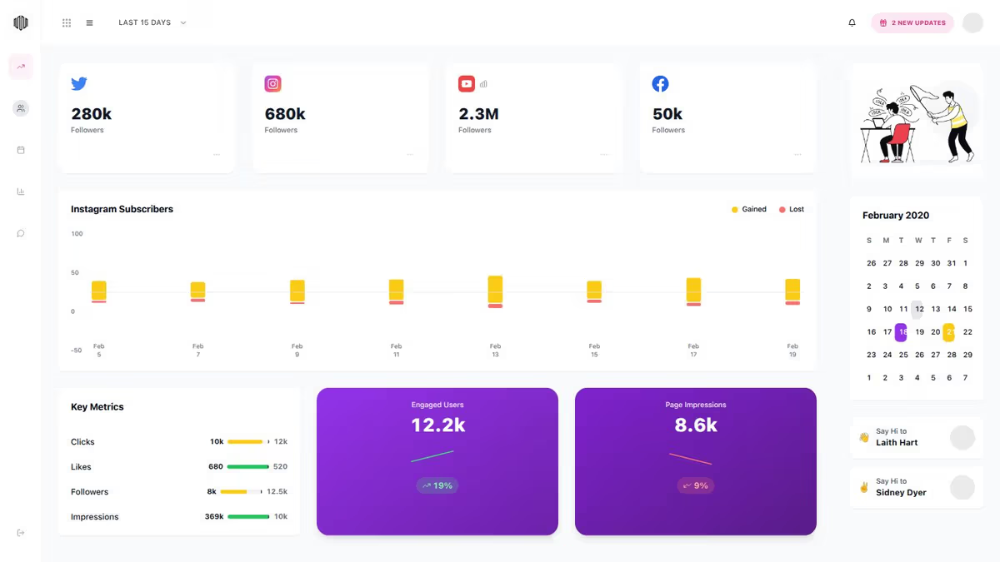

# 🚀 SocialBase - Social Media Dashboard

> A comprehensive, modern social media management dashboard built for content creators, social media managers, and businesses to streamline their social media operations.

## ✨ Features

### 📊 **Analytics & Insights**
- **Real-time Metrics**: Track followers, engagement, and growth across all platforms
- **Interactive Charts**: Beautiful visualizations using Recharts library
- **Performance Tracking**: Monitor clicks, likes, impressions, and engagement rates
- **Trend Analysis**: Identify patterns and optimize content strategy

### 📱 **Multi-Platform Management**
- **Unified Dashboard**: Manage Twitter, Instagram, YouTube, and Facebook from one place
- **Cross-Platform Analytics**: Compare performance across different social networks
- **Platform-Specific Metrics**: Tailored insights for each social media platform

### 👥 **Team Collaboration**
- **Team Management**: Add team members with role-based permissions
- **Real-time Chat**: Built-in communication system for team coordination
- **Task Assignment**: Delegate content creation and management tasks
- **Activity Tracking**: Monitor team member contributions and activities

### 📝 **Content Management**
- **Content Calendar**: Schedule and organize posts across platforms
- **Draft Management**: Save and edit content before publishing
- **Media Library**: Organize images, videos, and other media assets
- **Bulk Operations**: Manage multiple posts efficiently

### 🎨 **Modern UI/UX**
- **Responsive Design**: Optimized for desktop, tablet, and mobile devices
- **Dark/Light Mode**: Customizable theme preferences
- **Intuitive Navigation**: Clean, user-friendly interface
- **Accessibility**: WCAG compliant design for all users

## 🛠️ Tech Stack

### **Frontend**
- **Framework**: [Next.js 14](https://nextjs.org/) with App Router
- **Language**: [TypeScript](https://www.typescriptlang.org/) for type safety
- **Styling**: [Tailwind CSS](https://tailwindcss.com/) for utility-first styling
- **UI Components**: [shadcn/ui](https://ui.shadcn.com/) for consistent design system

### **Libraries & Tools**
- **Charts**: [Recharts](https://recharts.org/) for data visualization
- **Icons**: [Lucide React](https://lucide.dev/) for consistent iconography
- **Animations**: CSS transitions and transforms
- **State Management**: React hooks and context
- **Routing**: Next.js App Router for seamless navigation

### **Development**
- **Package Manager**: npm/yarn
- **Linting**: ESLint for code quality
- **Formatting**: Prettier for consistent code style
- **Version Control**: Git with conventional commits

## 🚀 Quick Start

### Prerequisites
- **Node.js** 18.0 or later
- **npm** or **yarn** package manager
- **Git** for version control

### Installation

1. **Clone the repository**
   \`\`\`bash
   git clone https://github.com/monirhossain09544/Social-Base-I-Social-Media-Dashboard.git
   cd Social-Base-I-Social-Media-Dashboard
   \`\`\`

2. **Install dependencies**
   \`\`\`bash
   npm install
   # or
   yarn install
   \`\`\`

3. **Run the development server**
   \`\`\`bash
   npm run dev
   # or
   yarn dev
   \`\`\`

4. **Open your browser**
   Navigate to [http://localhost:3000](http://localhost:3000) to see the application.

### Build for Production

\`\`\`bash
npm run build
npm start
\`\`\`

## 🌟 Highlights

### **Performance Optimized**
- **Fast Loading**: Optimized images and lazy loading
- **SEO Friendly**: Meta tags and structured data
- **Responsive**: Mobile-first design approach
- **Accessible**: WCAG 2.1 AA compliance

### **Developer Experience**
- **Type Safety**: Full TypeScript implementation
- **Component Library**: Reusable, well-documented components
- **Clean Code**: Consistent formatting and linting
- **Modern Practices**: Latest React and Next.js patterns

### **User Experience**
- **Intuitive Interface**: Easy-to-navigate design
- **Real-time Updates**: Live data synchronization
- **Customizable**: Personalized dashboard layouts
- **Cross-Platform**: Works on all devices

## 📊 Features Showcase

| Feature | Description | Status |
|---------|-------------|--------|
| 📈 Analytics | Comprehensive social media analytics | ✅ Complete |
| 👥 Team Management | Role-based team collaboration | ✅ Complete |
| 📝 Content Management | Post scheduling and organization | ✅ Complete |
| 💬 Team Chat | Real-time communication | ✅ Complete |
| 🎨 Modern UI | Beautiful, responsive interface | ✅ Complete |
| 📱 Mobile Support | Full mobile optimization | ✅ Complete |

## 🔧 Customization

The dashboard is highly customizable:

- **Themes**: Easily switch between light and dark modes
- **Layout**: Flexible grid system for custom arrangements
- **Colors**: Tailwind CSS for easy color scheme changes
- **Components**: Modular design for easy feature additions

## 📈 Performance Metrics

- **Lighthouse Score**: 95+ across all categories
- **First Contentful Paint**: < 1.5s
- **Largest Contentful Paint**: < 2.5s
- **Cumulative Layout Shift**: < 0.1

## 🤝 Contributing

Contributions are welcome! Please feel free to submit a Pull Request. For major changes, please open an issue first to discuss what you would like to change.

### Development Guidelines
1. Follow the existing code style
2. Write meaningful commit messages
3. Add tests for new features
4. Update documentation as needed

## 📄 License

This project is licensed under the MIT License - see the [LICENSE](LICENSE) file for details.

## 👨‍💻 Author

**Monir Hossain**
- GitHub: [@monirhossain09544](https://github.com/monirhossain09544)
- LinkedIn: [Connect with me](https://linkedin.com/in/monirhossain09544)
- Portfolio: [View my work](https://socialbase.vercel.app/)

## 🙏 Acknowledgments

- [Next.js](https://nextjs.org/) for the amazing React framework
- [Tailwind CSS](https://tailwindcss.com/) for the utility-first CSS framework
- [shadcn/ui](https://ui.shadcn.com/) for the beautiful component library
- [Vercel](https://vercel.com/) for seamless deployment
- [Lucide](https://lucide.dev/) for the icon library

---

⭐ **Star this repository if you found it helpful!**

📧 **Questions?** Feel free to reach out or open an issue.

🚀 **Live Demo**: [https://socialbase.vercel.app/](https://socialbase.vercel.app/)
